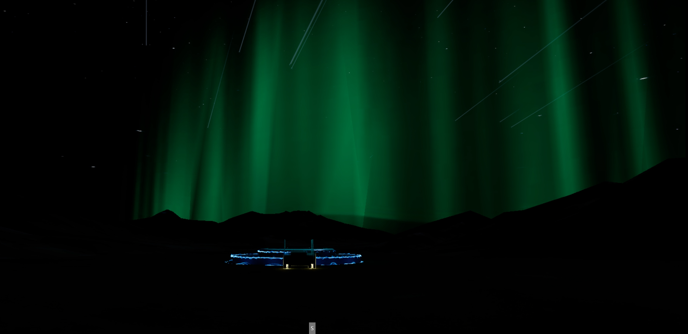
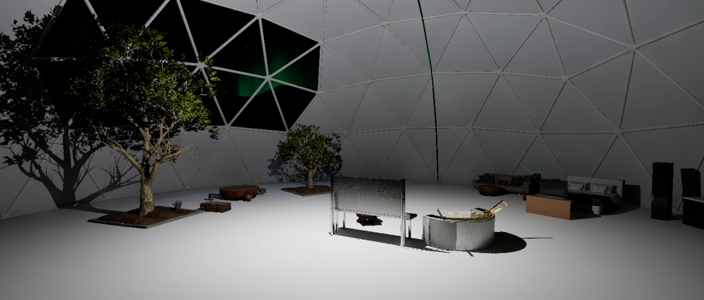

# Unknown

Unreal Engine과 VR을 활용해 제작한 SF 세계관 기반 개인 메타버스 프로젝트입니다.  
에너지 고갈 이후 새로운 우주를 탐사한다는 설정을 바탕으로, 공간 연출과 환경 디자인을 중심으로 구현했습니다.

> 본 프로젝트는 개인 학습 및 실험을 목적으로 진행한 미완성 프로젝트입니다.  
> Unreal Engine과 Blender를 익히는 과정에서 직접 기획하고 제작했으며, 환경 연출과 VR 공간 구현에 초점을 두었습니다.

---

## Preview

### Main Scene

### GIF Preview

---

## Additional Image

### Dome Interior

---

## Project Overview

**Unknown**은 미래 인류가 에너지 부족 문제에 직면한 상황에서, 새로운 우주에서 대체 에너지 자원을 탐사한다는 상상에서 출발한 프로젝트입니다.  
지구와 기존 우주에서 확보할 수 없는 대체 에너지 물질을 새로운 공간에서 찾아야 한다는 설정을 바탕으로,  
직접 구상한 세계관을 VR 환경 속 공간 연출로 구현하고자 했습니다.

---

## Development Background

머지않은 미래, 인류는 심각한 에너지 부족 문제에 직면하게 됩니다.  
기존의 대체 에너지 연구는 한계에 부딪히고, 지구와 현재의 우주에서는 더 이상 필요한 재료를 확보할 수 없는 상황에 이릅니다.

이 프로젝트는  
“지금은 불가능한 일도, 미래의 기술 발전으로 가능해질 수 있지 않을까?”  
라는 상상에서 시작했습니다.

오랫동안 통신이 끊겼던 탐사선이 새로운 데이터를 보내오기 시작하고,  
그 주변에서 과거 포기했던 대체 물질의 존재가 확인되면서 새로운 우주 탐사가 시작됩니다.  
인류는 양자기술 기반 인공 웜홀을 생성하고, 탐사 가능성을 검증하기 위해 휴머노이드 **Kairos**를 투입합니다.

---

## Character

- Player: 휴머노이드 **Kairos**

---

## Tech Stack

- Unreal Engine
- Blender
- VR

---

## Development Focus

- SF 세계관 기반 공간 연출
- Unreal Engine 기반 VR 환경 구현
- Blueprint 및 Cinematic 활용
- Blender를 활용한 환경 요소 제작 및 디자인

---

## Key Features

- Blueprint를 활용한 기본 연출 구성
- Cinematic을 활용한 장면 흐름 표현
- VR 환경 기반의 공간 제작
- SF 분위기의 배경 및 월드 연출 구현

---

## My Role

- 프로젝트 기획 및 세계관 구성
- 전체 파이프라인 설계
- Unreal Engine 기반 환경 구현
- Blender를 활용한 모델링 및 디자인

---

## Directly Created Assets

- Dome
- Aurora
- Star
- Wormhole

---

## Notes

- 일부 인테리어 요소는 외부 리소스를 활용했습니다.
- 오로라, 돔, 별, 웜홀 등 주요 환경 연출 요소는 직접 제작했습니다.
- 본 저장소는 완성형 결과물보다는, Unreal Engine과 VR 환경 제작을 학습하며 구현한 과정 중심의 개인 프로젝트를 정리한 포트폴리오입니다.
